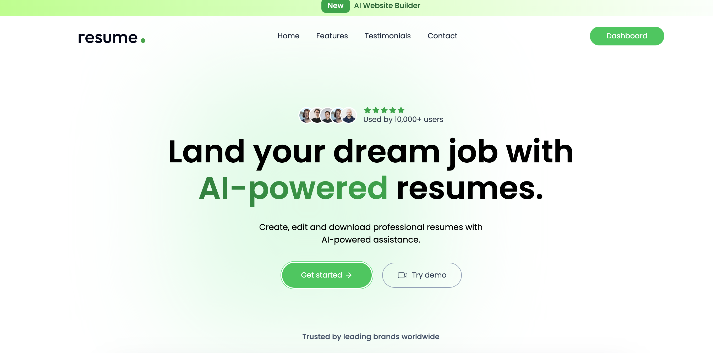

# Resume Builder

**AI-powered resume builder** by Sonu Kumar  
Create, edit, and save professional resumes with AI assistance, ATS scoring, PDF upload, and resume templates.

## 🚀 Live Demo
- 🔗 Live Project: https://ats-resume-builder-git-main-sonu-tech006s-projects.vercel.app/

## 📸 Screenshot


> Sonu Kumar

## 🔧 Tech Stack
[](https://react.dev/) [](https://nodejs.org/) [](https://expressjs.com/) [](https://www.mongodb.com/) [](https://tailwindcss.com/)

## 📁 Project Structure
- `client/` — React + Vite frontend
- `server/` — Node.js + Express backend
- `server/models` — Mongoose schemas
- `server/controllers` — API logic for auth, resumes, and AI features
- `client/src/pages` — application pages including ATS check and dashboard

## 🧰 Tools & Technologies
- React, Vite, TailwindCSS
- Node.js, Express, Axios
- MongoDB, Mongoose
- JWT authentication
- OpenAI / Gemini AI integration
- ImageKit integration for profile image upload
- PDF text extraction for resume upload

## ✅ What this app does
- User authentication and protected dashboard
- Create new resume or upload existing PDF resume
- Extract resume text and run ATS score prediction
- Save resume data to MongoDB
- Preview ATS score, prediction, reasons, and suggestions
- Responsive resume builder experience

## 🔧 Setup and Installation

### 1. Clone the repo
```bash
git clone https://github.com/sonu-tech006/Ats-resume-builder.git
cd Ats-resume-builder
```

### 2. Install dependencies
```bash
cd client
npm install
cd ../server
npm install
```

### 3. Environment variables
Create `server/.env` with:
```bash
PORT=3000
MONGODB_URI=<your mongo uri>
JWT_SECRET=<your jwt secret>
IMAGEKIT_PRIVATE_KEY=<your imagekit key>
OPENAI_API_KEY=<your openai or google api key>
OPENAI_BASE_URL=<openai base url>
OPENAI_MODEL="gemini-2.5-flash"
```
Create `client/.env` with:
```bash
VITE_BASE_URL=http://localhost:3000
```

### 4. Run locally
```bash
# Start frontend
cd client
npm run dev

# Start backend
cd ../server
npm run server
```

## 🚀 Deployment
### Backend on Render
1. Create a new Render Web Service.
2. Connect your GitHub repo.
3. Set the root directory to `server/`.
4. Set the build command: `npm install`
5. Set the start command: `npm run start`
6. Add Render environment variables from `server/.env`.
7. Deploy.

### Frontend on Vercel
1. Create a new Vercel project.
2. Connect your GitHub repo.
3. Set the root directory to `client/`.
4. Set build command: `npm install && npm run build`
5. Set output directory: `dist`
6. Add environment variable:
   - `VITE_BASE_URL=<your render backend URL>`
7. Deploy.

## 📌 Notes
- Use the Render backend URL in frontend `VITE_BASE_URL` after deploy.
- Make sure the backend has access to MongoDB and OpenAI/Gemini keys.
- If you change the deploy URLs, update `client/.env` and redeploy.

## 📬 Contact
- Email: sonukr7435@gmail.com
- GitHub: https://github.com/sonu-tech006

---

Made with ❤️ by Sonu Kumar

